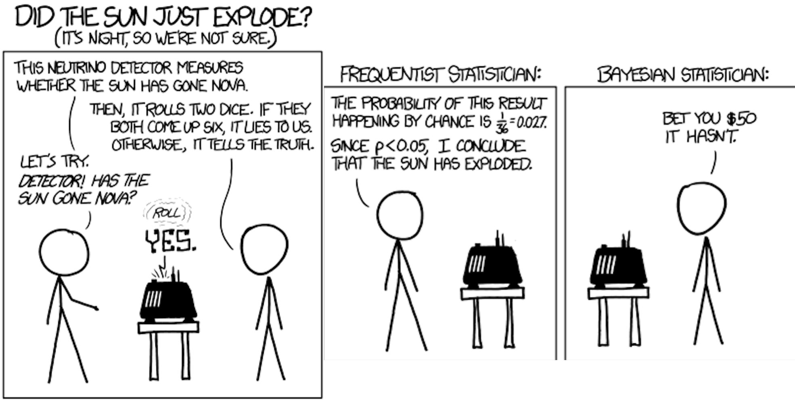
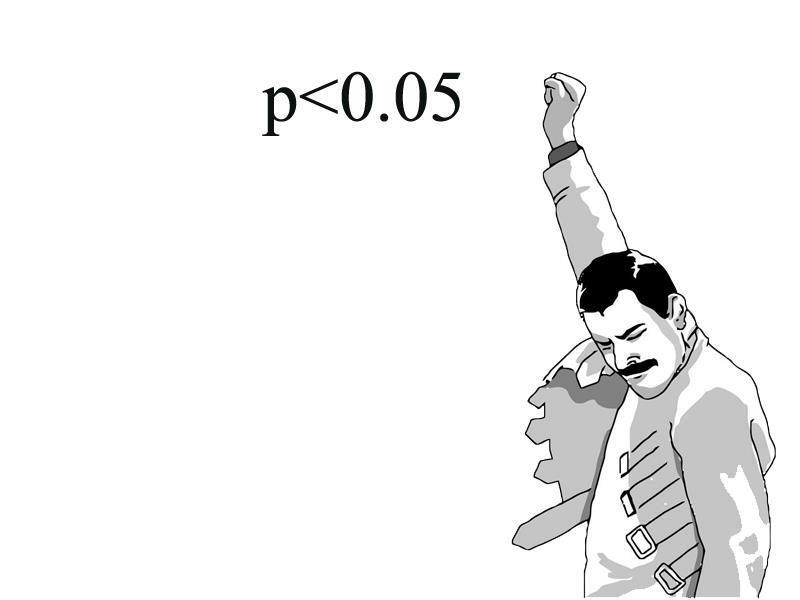
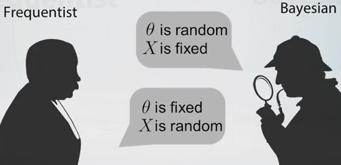
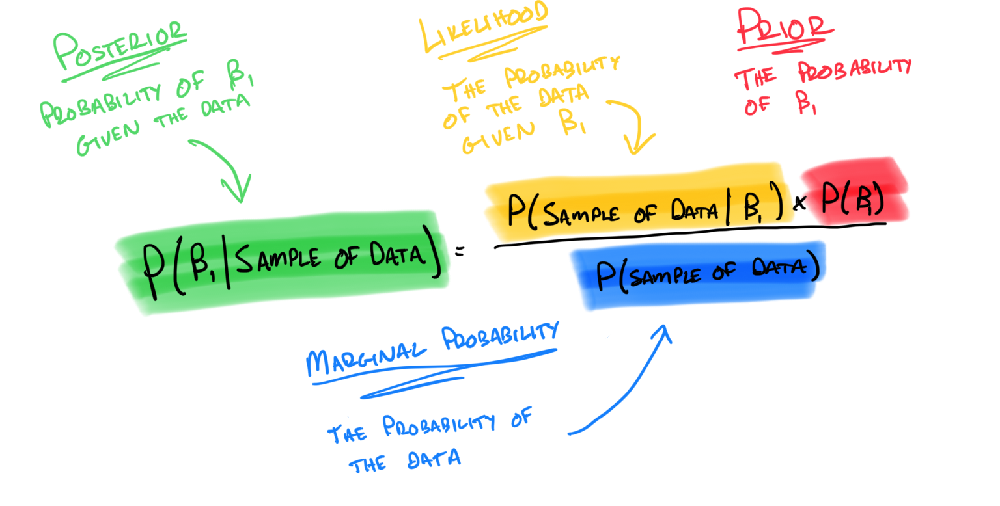
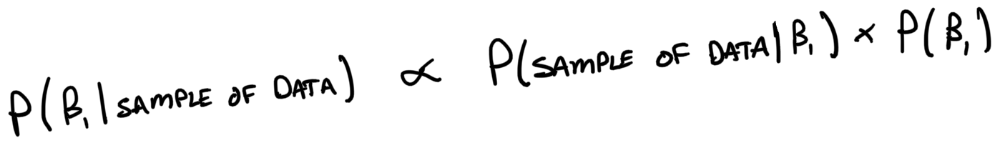
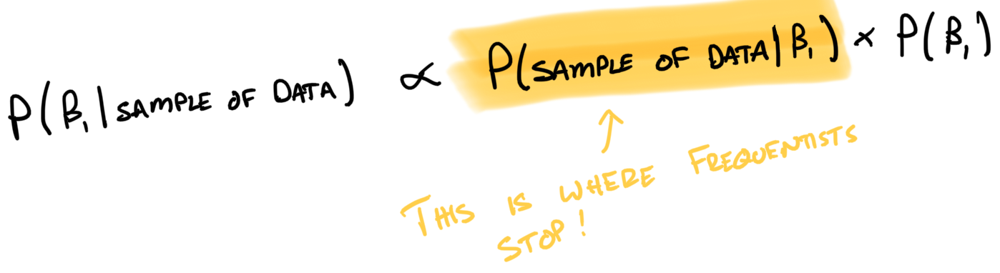

```{r setup, include=FALSE}
knitr::opts_chunk$set(echo = TRUE)
```

## Bayes vs. Frequentism

{width="100%"}

## What is the Frequentist Way...?



## What is the Frequentist Way?

How do we get the best estimate for the impact of engine size on mpg?

$$
\text{MPG} = \beta_0 + \beta_1 \times \text{Engine Size} + \epsilon
$$

-   Ideally, we want to know $P(\beta_1 | \text{Sample of Data})$
-   The frequentist says that this isn't possible. Instead...
-   Find value of $\beta_1$ that maximizes the probability of observing the data we have
-   $P(\text{Sample of Data} | \beta_1)$

## More on the Frequentist Way

-   To the frequentist it makes no sense to talk about the probability of $\beta_1$

-   That's because $\beta_1$ is fixed. Probability is related to repeated experiments

-   When we get an estimate for $\beta_1$ we *usually* talk about it with respect to a null hypothesis

-   The p-value doesn't tell us the probability of a hypothesis being true, **or** the probability that the result happened by chance

-   This is what it does tell us: "Assuming that the null hypothesis is true, there is a *p-value* chance of the result we got being at least as extreme as the results observed"

## Even More on the Frequentist Way

But what about confidence intervals?

-   Confidence intervals are statements about repeated experiments

-   It doesn't tell us anything about the probability of an estimate

-   The question it answers: "Give me an interval that will bracket the true value of the parameter in 95% of the instances of an experiment that is repeated a large number of times"

-   Confused? That is the frequentist way...

## The Bayesian Way

Back to our original question: How we get the best estimate for the impact of engine size on mpg?

$$
\text{MPG} = \beta_0 + \beta_1 \times \text{Engine Size} + \epsilon
$$

-   The Bayesian way is to calculate the $P(\beta_1 | \text{Sample of Data})$

-   Bayesians want to estimate a parameter ($\beta_1$) and talk about the probability of that estimate

## The Bayesian Way

-   Instead of a p-value, they just directly talk about the probability of the estimate

-   "There's a 97% probability that $\beta_1$ is equal to 6.8"

-   Bayesians have intervals too!

-   The credible interval answers: "Give me an interval that brackets the true value with a 95% probability given the data that I have."

## Bayes vs. Frequentism

{width="100%"}

## Bayes Theorem

{width="100%"}

## Bayes Theorem

{width="100%"}

## Bayes Theorem

{width="100%"}

## Aren't Priors Subjective Though??

-   Yes, they are but it doesn't really matter

-   Likelihood functions are subjective

-   So are link functions, data collection stopping points, and ...

-   There are different kinds of priors we can use

## Components of a Bayesian Model

-   Likelihood function

-   Priors

## Likelihood Functions

-   Usually we use the normal (gaussian) distribution

    -   `lm(y ~ x)`

    -   `glm(y ~ x, family = gaussian(link = "identity"))`

-   Another common choice is the binomial distribution

    -   `glm(y ~ x, family = binomial(link = "logit"))`

## Priors

There are different types of priors we can use:

-   Non-informative or "flat" priors

-   Weakly informative priors

-   Informative priors

## Non-informative (flat) Priors

```{r echo = FALSE}
# Some MPG Data
x <- seq(from = 0, to = 50, by = 0.1)
```

```{r}
# Frequentist Priors
curve(dunif(x, min = -1000000, max = 1000000), from = -1000000, to = 1000000)
```

## Non-informative (flat) Priors

```{r}
# Flat Priors
curve(dunif(x, min = -100, max = 100), from = -110, to = 110)
```

## Weakly Informative Priors

```{r}
curve(dnorm(x, mean = 0, sd = 20), from = -50, to = 50)
```

## Informative Priors

```{r}
curve(dnorm(x, mean = -3, sd = 2), from = -10, to = 10)
```

# The Bayesian Workflow

Data analysis with Bayesian methods involves a series of steps:

1.  Prior Simulations
2.  Model Fitting
3.  Convergence Diagnostics
4.  Posterior Predictive Checks
5.  Model Summary and Visualization
