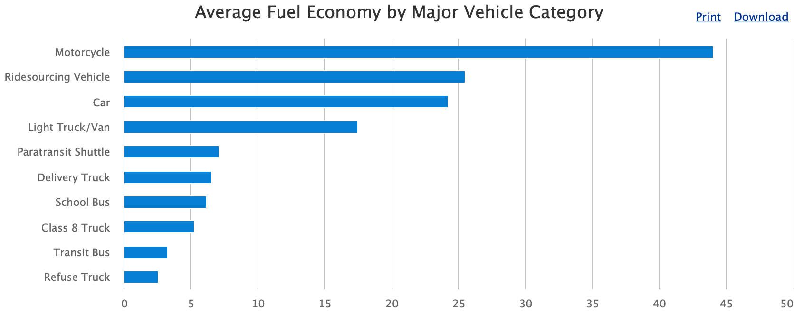

# Introduction

In this document, we'll walk through the Bayesian workflow for data analysis using the R package `brms`. To get started, we need to install Stan and `brms`. This involves a couple steps. Here are the instructions for MacOS and Windows which you can also find here (<https://learnb4ss.github.io/learnB4SS/articles/install-brms.html>):

[Note: this installation take about 20 minutes to complete.]{style="color:red"}

## MacOS Installation Instructions

To install `brms` on MacOS, you have to do four steps:

1.  Make sure you are running the latest version of R (4.0 or later)
2.  Install `rtools`
3.  Install `Rstan`
4.  Install `brms`

### 1. Install R v4.0 or Later

Go here to install the latest version of R: <https://cran.r-project.org/mirrors.html>

### 2. Install `rtools`

In order to install `rtools` on MacOS, we have to install the Xcode Command Line Tools and `gfortran`.

First, let's install the Xcode Command Line Tools. Open Terminal (`Finder` \> `Applications` \> `Terminal`), then type in the following command and press enter:

```{bash eval = FALSE}
xcode-select --install
```

After this finishes (it might take a while), we can install `gfortran`. If you have an Intel Mac download and install this file: <https://github.com/fxcoudert/gfortran-for-macOS/releases/tag/8.2>. If you have a Mac with an Apple chip, download and install this file: <https://github.com/fxcoudert/gfortran-for-macOS/releases/tag/11-arm-alpha2>.

### 3. Install `Rstan`

```{r eval = FALSE}
install.packages("rstan", repos = "https://cloud.r-project.org/", dependencies = TRUE)
```

Wait! Did you install it right? Run this to check:

```{r eval = FALSE}
example(stan_model, package = "rstan", run.dontrun = TRUE)
```

### 4. Install `brms`

```{r eval = FALSE}
install.packages("brms")
```

## Windows Installation Instructions

### 1. Install R v4.0 or Later

Go here to install the latest version of R: <https://cran.r-project.org/mirrors.html>

### 2. Install `rtools`

To install rtools, go here, download the file (.exe) and install it: <https://cran.r-project.org/bin/windows/Rtools/>

### 3. Install `Rstan`

```{r eval = FALSE}
install.packages("rstan", repos = "https://cloud.r-project.org/", dependencies = TRUE)
```

Wait! Did you install it right? Run this to check:

```{r eval = FALSE}
example(stan_model, package = "rstan", run.dontrun = TRUE)
```

### 4. Install `brms`

```{r eval = FALSE}
install.packages("brms")
```

# Preparation

To get started we'll need to load the `tidyverse` and `brms` R packages and load in the data.

*Our goal is to estimate the relationship between engine size and highway MPG.*

```{r}
library(tidyverse)
library(brms)

data("mpg")

summary(mpg)
```

# Picking Priors

Plotting priors is the best way to understand how influential they are (this is especially true when we are using link functions like Logit and log). There are two ways to do this. First we can simply plot the prior densities. Second, we can preform full prior predictive simulation. Let's try both.

Remember, the goal here is to pick a prior for the effect of engine size on a vehicle's highway MPG. Engine size is measured in liters so what sounds reasonable? Would an increase in the size of an engine by 1 liter decrease MPG by 1000? Probably not. Maybe more like 1-3 MPG?

## Plotting Prior Densities

```{r}
# Some MPG Data
x <- seq(from = 0, to = 50, by = 0.1)

# Frequentist Priors
curve(dunif(x, min = -1000000, max = 1000000), from = -1000000, to = 1000000)

# Flat Priors
curve(dunif(x, min = -100, max = 100), from = -110, to = 110)

# Weakly Informative Priors
curve(dnorm(x, mean = -5, sd = 20), from = -50, to = 50)

# Informative Priors
curve(dnorm(x, mean = -3, sd = 2), from = -10, to = 10)
```

## Prior Predictive Simulations

Another option for picking priors is to build a complete prior predictive simulation. Basically, this means that we run the model we are interested in without the data. To do this, we also need to pick a prior for the intercept.

To see how priors affect what the model knows we'll look at "frequentist" priors, weakly informative priors, and very informative priors.

It's easy to pick a prior for the intercept if we remember that the intercept is just the mean of the outcome variable. What do you think the average highway MPG is for cars in the US? 1000, -1000, 15, 30? Remember that frequentist analyses use completely uninformative priors - all values are possible.

### "Frequentist" Priors

Frequentist models assume that all values are equally likely. In other words, they give no information to the model to improve prediction.

```{r}
# Number of simulations
sample.size <- 100

# Prior for the intercept
intercept <- runif(sample.size, min = -10000000, max = 10000000)

# Prior for the effect of engine size
b_1 <- runif(sample.size, min = -10000000, max = 10000000)

# Variables
x <- mpg$displ
xbar <- mean(mpg$displ)

# Prior Predictive Simulation
plot(NULL, xlim = range(mpg$displ), ylim = c(-100, 200),
     xlab = "Engine Size", ylab = "Highway MPG")
abline(h = 0, lty = 1, lwd = 1.5, col = "black")
abline(h = 142, lty = 1, lwd = 1.5, col = "black")
for (i in 1:sample.size) {
  curve(intercept[i] + b_1[i] * (x - xbar), from = min(mpg$displ), 
        to = max(mpg$displ), add = TRUE, col = "gray")
}
```

### Weakly Informative Priors

Using weakly informative priors is almost always a better option. In nearly every case, we at least know *something* about the kind of effects/estimates we expect to find. In the example of engine size and MPG, an increase of one liter in engine size probably won't affect highway MPG but 1,000 or even 100.

My guess is that the average car MPG is probably around 20, so we'll use that as the mean for the prior on our intercept. Since I'm not too certain in this guess, I'll still use a big standard deviation. As for the effect of engine size, I expect the effect to be negative and not too large so I'll use -5 with a wide standard deviation.

```{r}
# Number of simulations
sample.size <- 100

# Prior for the intercept
intercept <- rnorm(sample.size, mean = 20, sd = 20)

# Prior for the effect of engine size
b_1 <- rnorm(sample.size, mean = -5, sd = 20)

# Variables
x <- mpg$displ
xbar <- mean(mpg$displ)

# Prior Predictive Simulation
plot(NULL, xlim = range(mpg$displ), ylim = c(-100, 200),
     xlab = "Engine Size", ylab = "Highway MPG")
abline(h = 0, lty = 1, lwd = 1.5, col = "black")
abline(h = 142, lty = 1, lwd = 1.5, col = "black")
for (i in 1:sample.size) {
  curve(intercept[i] + b_1[i] * (x - xbar), from = min(mpg$displ), 
        to = max(mpg$displ), add = TRUE, col = "gray")
}
```

This plot shows the predicted highway MPG based only on our choice of priors for the intercept and slope. It's not too bad, but there are definitely some outliers.

### Informative Priors

What happens when we use really informative priors? Here is some data on the average MPG for different cars:



```{r}
# Prior for the intercept
intercept <- rnorm(sample.size, mean = 25, sd = 5)

# Prior for the effect of engine size
b_1 <- rnorm(sample.size, mean = -3, sd = 2)

# Variables
x <- mpg$displ
xbar <- mean(mpg$displ)

# Prior Predictive Simulation
plot(NULL, xlim = range(mpg$displ), ylim = c(-100, 200),
     xlab = "Engine Size", ylab = "Highway MPG")
abline(h = 0, lty = 1, lwd = 1.5, col = "black")
abline(h = 142, lty = 1, lwd = 1.5, col = "black")
for (i in 1:sample.size) {
  curve(intercept[i] + b_1[i] * (x - xbar), from = min(mpg$displ), 
        to = max(mpg$displ), add = TRUE, col = "gray")
}
```

# Model Fitting

Now that we know what priors we want to use, we're ready to fit the model. We'll estimate three different models each using either "frequentist" priors, weakly informative priors, and informative priors. As a baseline, we'll estimate the frequentist model.

```{r}
# First lets create a mean centered version of displ
mpg <- 
  mpg %>% 
  mutate(displ_c = displ - mean(displ))

fq.fit <- glm(hwy ~ displ_c,
              family = gaussian(),
              data = mpg)
summary(fq.fit)
```

## "Frequentist" Prior Model

```{r}
bfit.1 <- brm(hwy ~ displ_c, # model formula
              family = gaussian(), # the likelihood function
              data = mpg, # the data the model is using
              prior = c(prior(uniform(-10000000, 10000000), class = "Intercept"),
                        prior(uniform(-10000000, 10000000), class = "b")),
              silent = 2,
              refresh = 0)
bfit.1
```

## Weakly Informative Prior Model

```{r}
bfit.2 <- brm(hwy ~ displ_c, # model formula
              family = gaussian(), # the likelihood function
              data = mpg, # the data the model is using
              prior = c(prior(normal(20, 20), class = "Intercept"),
                        prior(normal(-5, 20), class = "b")),
              silent = 2,
              refresh = 0)
bfit.2
```

## Informative Prior Model

```{r}
bfit.3 <- brm(hwy ~ displ_c, # model formula
              family = gaussian(), # the likelihood function
              data = mpg, # the data the model is using
              prior = c(prior(normal(25, 5), class = "Intercept"),
                        prior(normal(-3, 2), class = "b")),
              silent = 2,
              refresh = 0)
bfit.3
```

# Convergence Diagnostics

We always need to check the convergence of each model because they are estimated using MCMC. There are a couple ways we can check convergence. The first way is to check convergence is with a visual inspection of the traceplots. The `bayesplot` package makes it easy to make traceplots.

```{r}
library(bayesplot)

mcmc_trace(bfit.2)
```

The "fuzzy caterpillar" is what we want to see. Each MCMC chain is a separate line and we want to see each line "mixing" with one another. If they will all separate that would mean that each chain has a different estimate.

Another way to check the model's convergence is to look at the Rhat values.

```{r}
bfit.2

# rhat plot
rhats <- rhat(bfit.2)
mcmc_rhat(rhats) + xlim(1, 1.001)
```

# Posterior Predictive Checks

One of the unique things about Bayesian analysis is the fact that we can preform posterior predictive checks. What is a posterior predictive check? The basic idea is that if we can create a model that accurately predicts the data we have, then we should be able to use the same model to generate new data points.

```{r}
pp_check(bfit.2, type = "dens_overlay", ndraws = 100)
```

$y$ is the actual data and $y_{rep}$ is the data that was generated from the model. An accurate model would be able to generate new data points that follow the same distribution as the actual data. Based on this plot, it looks like we are missing some of the variation in the middle.

# Results Table

```{r}
library(broom.mixed)
library(knitr)
library(kableExtra)

results.table <- 
  tidyMCMC(bfit.3, 
           robust = TRUE,
           conf.int = TRUE,
           conf.method = "HPDinterval") %>% 
  mutate(conf.int = sprintf("(%.1f, %.1f)", conf.low, conf.high)) %>% 
  select(term, estimate, std.error, conf.int)

kable(results.table,
      escape = FALSE,
      booktabs = TRUE,
      digits = 2,
      align = c("l", "r", "r", "c"),
      col.names = c("Parameter", "Point Estimate", "SD",
                    "95% HDI Interval ")) %>% 
  kable_styling(latex_options = c("striped", "hold_position"))
```

# Results Visualization

Just like in frequentist statistics, we can create a coefficient plot where we see the point estimate and the 95% interval.

```{r}
mcmc_plot(bfit.2, variable = "b_displ_c")
```

One of the best things about Bayesian analysis, however, is that we don't just get a single point estimate. Instead we get an entire distribution of estimates. This is distribution is called the posterior distribution. We can plot it like a histogram.

```{r}
mcmc_hist(bfit.2, pars = "b_displ_c")
```

```{r}
mcmc_areas(bfit.2, pars = "b_displ_c", prob = 0.95)
```

# Results Interpretation

The interpretation of the results is very easy. Let's pull them up:

```{r}
bfit.2
```

By default, `brms` shows us the mean point estimate but we could just as easily use the median or mode.

-   The mean point estimate is shown in the `Estimate` column.

-   `Est.Error` is the standard deviation of the posterior distribution.

-   `l-95% CI` and `u-95% CI` are the lower and upper 95% credible interval estimates. Remember, the 95% credible interval tells us the range of values that will contain the true value with a 95% probability.

-   `Rhat` tells us about convergence. A value greater than 1.1 is bad.

-   `Bulk_ESS` and `Tail_ESS` show the number of independent draws. The higher the better.

Read more about these things here: <https://mc-stan.org/misc/warnings.html>.

Let's interpret the effect of `displ_c` on `hwy`: A one unit change in `displ_c` is associated with a $-3.53$ decrease in a vehicle's highway MPG. This effect has a standard deviation of $0.19$ and there is a 95% probability that the true value is between $-3.90$ and $-3.14$.

# Bonus: How Influential Are Our Priors?

To see how much our choice of priors influenced the posterior distribution we just compare the two distributions. To do this, we can draw samples from our priors when we estimate the model using the argument `sample_prior = "yes"`. This will save the prior distributions so we can plot them later.

```{r}
bfit.2 <- brm(hwy ~ displ_c, # model formula
              family = gaussian(), # the likelihood function
              data = mpg, # the data the model is using
              prior = c(prior(normal(20, 20), class = "Intercept"),
                        prior(normal(-5, 20), class = "b")),
              silent = 2,
              refresh = 0,
              sample_prior = "yes")

priors <- prior_draws(bfit.2)
priors
```

This shows all 4,000 draws from the priors that we used. If we summarize them, we'll see that the mean is *just about* equal to what we set it to.

```{r}
summary(priors)
```

Now we can plot them:

```{r}
ggplot() +
  geom_density(data = priors, aes(x = b)) +
  labs(title = "Prior Distribution") +
  theme_classic()
```

We can also plot the posterior distribution:

```{r}
posteriors <- as.data.frame(bfit.2)

ggplot() +
  geom_density(data = posteriors, aes(x = b_displ_c), color = "blue") +
  labs(title = "Posterior Distribution") +
  theme_classic()
```

It's easy to see the comparison of the prior distribution to the posterior if we put them on the same plot. Since the x-axes are so different, however, we'll need to make some manual adjustments.

```{r}
ggplot() +
  geom_density(data = priors, aes(x = b)) +
  geom_density(data = posteriors, aes(x = b_displ_c), color = "blue") +
  labs(title = "Prior Distribution vs. Posterior Distribution") +
  xlim(-10, 10) +
  theme_classic()
```

That's a pretty uninformative prior. How do the priors from the informative model compare?

```{r}
bfit.3 <- brm(hwy ~ displ_c, # model formula
              family = gaussian(), # the likelihood function
              data = mpg, # the data the model is using
              prior = c(prior(normal(25, 5), class = "Intercept"),
                        prior(normal(-3, 2), class = "b")),
              silent = 2,
              refresh = 0,
              sample_prior = "yes")

priors <- prior_draws(bfit.3)
posteriors <- as.data.frame(bfit.3)

ggplot() +
  geom_density(data = priors, aes(x = b)) +
  geom_density(data = posteriors, aes(x = b_displ_c), color = "blue") +
  labs(title = "Prior Distribution vs. Posterior Distribution") +
  xlim(-10, 10) +
  theme_classic()
```

# Resources

Looking to learn more about all of this Bayesian stuff? I recommend the following resources:

-   [Statistical Rethinking](https://xcelab.net/rm/statistical-rethinking/) and the [tidyverse/brms translation](https://bookdown.org/content/4857/)

-   [Regression and Other Stories](https://www.cambridge.org/us/academic/subjects/statistics-probability/statistical-theory-and-methods/regression-and-other-stories?format=PB)

-   [Doing Bayesian Data Analysis](https://sites.google.com/site/doingbayesiandataanalysis/) and the [tidyverse/brms translation](https://bookdown.org/content/3686/)

-   The [bayestestR](https://easystats.github.io/bayestestR/articles/example1.html) tutorials

-   [Become a Bayesian with R & Stan](http://m-clark.github.io/workshops/bayesian/01_intro.html#introduction)

-   [Updating: A Set of Bayesian Notes](https://jrnold.github.io/bayesian_notes/index.html)

-   [Practical Bayes Part I](https://m-clark.github.io/posts/2021-02-28-practical-bayes-part-i/#mac) & [II](https://m-clark.github.io/posts/2021-02-28-practical-bayes-part-ii/)
