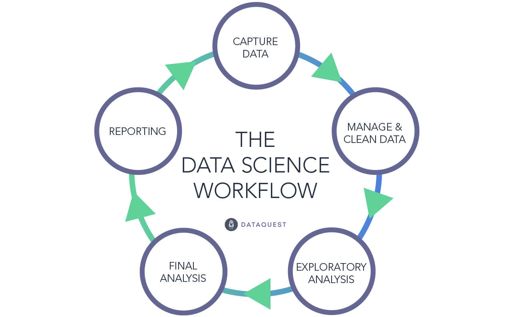

```{r setup, include=FALSE}
knitr::opts_chunk$set(echo = FALSE)
```

## What is Data Science?

* *"An inter-disciplinary field that uses scientific methods, processes, algorithms and systems to extract knowledge and insights from many structural and unstructured data"* - Wikipedia

<center>

</center>

* Basically just using data to answer questions

## What is Data Science?

* **Easier questions:**

1. What states spend the most money on healthcare? 
2. What percentage of Republicans voted for Obama?

* **Harder questions:**

3. How do seat belt laws affect traffic fatalities?
4. Do job training programs reduce unemployment?

* *bottom line - we need data to answer these!*

## Data Science is a Process

<center>

</center>

## Examples of Clean Data

```{r comment = ""}
head(mtcars)
```

1. What does each row describe?
2. Can you tell what the values in each column represent?

## Examples of Clean Data

```{r comment = "", message = FALSE}
data("Grunfeld", package = "plm")

library(tidyverse)
Grunfeld <- 
  Grunfeld %>%
  filter(year > 1952)

head(Grunfeld)
```

1. What does each row describe?
2. Can you tell what the values in each column represent?

## Examples of Messy Data

```{r, message = FALSE}
x <- rnorm(100, 4, 1.5)
y <- rbeta(100, 4, 3)
z <- rep(seq(from = 0, to = 1, by = 1), 50)

messy.matrix <- cbind(x, y, z)

head(messy.matrix)
```

1. What does each row describe?
2. Can you tell what the values in each column represent?

## Examples of Messy Data

```{r message = FALSE, comment = ""}
messy.df <- data.frame(x, y, z)

messy.df <- 
  messy.df %>%
  rename(CPO1976 = x,
         DCO9679 = y) %>%
  mutate(z = ifelse(z == 0, -999, z),
         t = round(CPO1976, digits = 0),
         t = as.character(t),
         t = str_replace(t, "5", " "))

head(messy.df)
```

1. What does each row describe?
2. Can you tell what the values in each column represent?

## Messy Data is Bad

* Data should be meaningful (or it's not useful)
* We need to be able to understand what the data tells us when we look at it
  * What do the rows describe?
  * What does each value mean?

## Exploratory Analysis

* Once we understand our data we can explore it

* Let's use an example

  * Suppose we want to know about what predicts a car's miles per gallon in the city
  
  * To explore this question, we'll use data on vehicle mpg:
  
```{r comment = ""}
head(mpg)
```

## Exploratory Analysis

* How many different manufacturers do we have in our data?

  * `r n_distinct(mpg$manufacturer)`

* What are the oldest and youngest cars in our data?

  * `r range(mpg$year)`

## Exploratory Analysis

* What are the average city and highway MPG ratings?

```{r comment = ""}
mpg %>%
  select(cty, hwy) %>%
  summary()
```

## Exploratory Analysis

```{r message = FALSE}
ggplot(data = mpg, aes(x = cty)) +
  geom_histogram()
```

## Exploratory Analysis

```{r message = FALSE}
ggplot(data = mpg, aes(x = displ, y = cty)) +
  geom_point()
```

## Exploratory Analysis

```{r message = FALSE}
ggplot(data = mpg, aes(x = displ, y = cty, color = class)) +
  geom_point()
```

## Modeling

* In the modeling stage we estimate formal relationships between variables

* We can also make predictions about future data

```{r message = FALSE}
ggplot(data = mpg, aes(x = displ, y = cty)) +
  geom_point() +
  geom_smooth()
```

## Workshop Overview

In this workshop series, we'll work through each stage of this process

1. Data cleaning

2. Exploratory analysis

3. Modeling

* We'll walk through each of these steps first using Stata then using R

## Workshop Learning Objectives

If you give an honest effort to solve each problem in this class, I promise that you will be able to do the follow at the end of the workshop:

1. Load a data set in Stata and R and clean it for analysis

2. Calculate descriptive statistics and visualize your data in Stata and R

3. Analyse data with basic modeling techniques in Stata and R

4. Visualize the results of your model and generate predictions

## Stata

* Stata is a commercial statistical software program

* Stata uses a simplified syntax to make it easy to use
  
* Also has easy "point-and-click" options (we will avoid these)
  
## R

* R is an open source programming language specially designed for data science

* R is completely free: [https://www.r-project.org](https://www.r-project.org)

* R relies on code which makes it more complicated than Stata

* R is much more flexible than Stata

* To show R I'll be using RStudio: [https://rstudio.com](https://rstudio.com/products/rstudio/)
